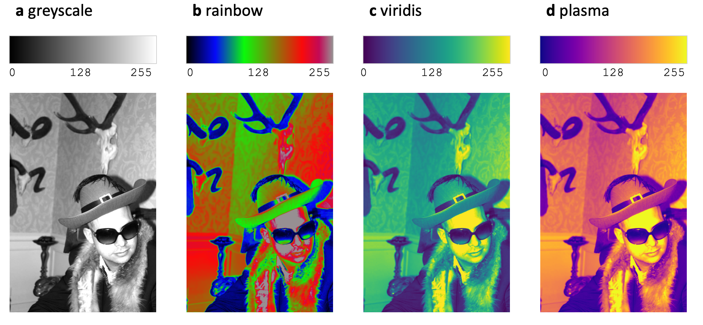
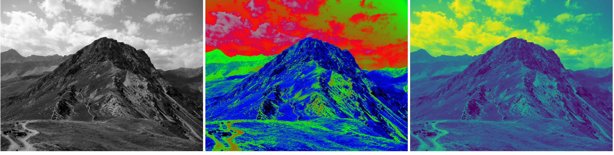

## Reviving the Nature Methods series - Points of View anew
My first article in the revived Springer Nature Methods data visualization series is now online! A [gift link courtesy of Nature](https://rdcu.be/fnPhk)

“Color Scales and the Birth of Viridis” tells the story of viridis, one of the most influential scientific color scales of the last decade. Designed as a perceptually uniform and colorblind-friendly alternative to rainbow color maps, viridis has become a standard tool for visualizing quantitative data across many fields of science. The piece explores how it was developed and why seemingly simple choices such as color scales can profoundly influence how we interpret data.

::: {#fig-NewLennaScales}

NewLenna shown in different color scales to compare how they display structures (for the backstory of this image, see end of post). 

:::

This article is particularly meaningful to me because it connects two longstanding interests. About fifteen years ago, while working with multimodal omics datasets ([Jambor et al](https://elifesciences.org/articles/5003))
, combining imaging, transcriptomics and genetics, I really needed well crafted figures and data visualization that could present insights from 30,000 pictures concisely. The challenges I faced was not biological, but visual data complexity: How do I simplify data for comprehension? How do we reveal patterns without distorting them? How do we communicate uncertainty, scale, and relationships effectively?

Over time, this consumed me and is now my research focus at the UAS Grisons. Today, I research, write and think about exploration of scientific data visually, but also figures for presentation and publication and lastly data communication with visual aids, e.g. in medicine. 

::: {#fig-Grisons}

A mountain ridge in Grisons, illustrating the distortions introduced by rainbow color scales, while structure and details are preserved with Viridis color scale. 
Foto: Andres Passwirth CC BY-SA 3.0, https://commons.wikimedia.org/w/index.php?curid=17166331

:::

A final note on the image used to illustrated the color scales in the article: many thanks to my friend and colleague Stephan Preibisch for "modeling" (he had to sign a model contract for nature). His portrait became part of the bio-imaging community's effort to move beyond the [problematic “Lenna” test image](https://en.wikipedia.org/wiki/Lenna) and address a longstanding and widely discussed issue in the culture of image processing and computer vision.

